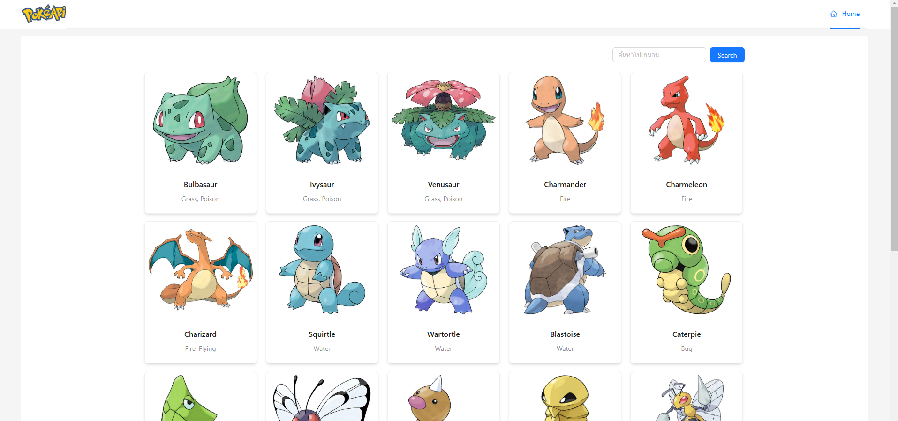

# 🔍 Search Pokémon Application

A Next.js application built with TypeScript, GraphQL, and Apollo Client to search and display Pokémon details.

---

## 🌟 Demo

[Live Demo on Vercel](https://search-pokemon-six-rose.vercel.app/)

---

## 📌 Features

- Search Pokémon by name
- Display Pokémon details:
  - Types
  - Classification
  - Height, Weight
  - Attacks (Fast and Special)
  - Weaknesses
  - Evolutions
- Easy navigation between Pokémon evolutions
- Optimized performance with Static Optimization, Apollo caching, and React memoization
- Unit testing with Jest and React Testing Library

---

## 🛠️ Technology Stack

- **Next.js**
- **React (TypeScript)**
- **GraphQL & Apollo Client**
- **Ant Design** (UI Framework)
- **Jest & React Testing Library** (for Testing)

---

## 🚧 Installation

Clone the repository and install dependencies:

```bash
git clone https://github.com/your-username/search-pokemon.git
cd search-pokemon
npm install
```

## 🏃 Running the App
Run development server:

```bash
npm run dev
Open http://localhost:3000
```


## ✅ Running Tests
Run unit tests:

```bash
npm run test
```

## Contact
BainaryTD
Email: tpk.devx@gmail.com
GitHub: BainaryTD